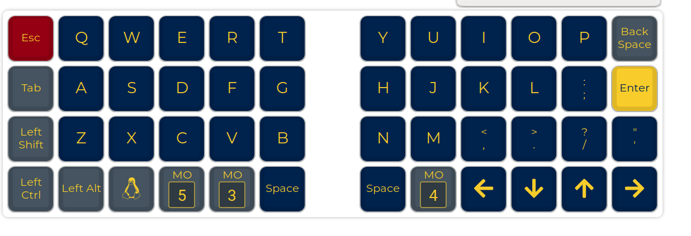

## Keyboard keymap sources

Qmk firmware https://github.com/qmk/qmk_firmware

Qmk firmware guide https://docs.qmk.fm/#/

Custom keymaps generated with: https://config.qmk.fm/#/lets_split/rev2/LAYOUT

Let's split guide https://github.com/AlexAvlonitis/lets-split-guide

### How to use

- Download the qmk firmware and cd into it

**Let's split instructions**

- Copy the custom subfolder(alex) from this project into qmk firmare path: qmk_firmware/keyboards/lets_split/keymaps/`

1) Connect both halves with the TRRS cable

2) Connect the USB cable on the left half first

3) cd back to the root of the qmk firmware project folder

4) Run sudo make lets_split/rev2:YOUR_FOLDER_NAME:avrdude e.g. `sudo make lets_split/rev2:alex:avrdude`

5) Follow the instructions, it will ask you to reset the controller to identify the port.

6) Unplug the left half and connect the right one. Repeat from step 4

The layout for this example: 
